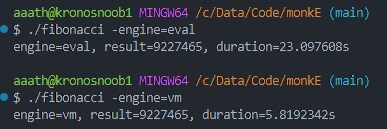

# monkE Interpreter & Compiler

This project is an implementation of an interpreter and compiler for the `monkE` programming language, inspired by the books **"Writing an Interpreter in Go"** and **"Writing a Compiler in Go"** by Thorsten Ball.
```monkE
>> print("Hello World from monkE!!");
Hello World!!
null
```

## Overview

`monkE` is a simple, dynamically-typed programming language. The interpreter is written in Go, and work is underway to convert it into a bytecode compiler and virtual machine.

The aim of the project was to learn core concepts of interpreters and compilers such as:
- lexer
- parser
- abstract syntax tree
- object system
- evaluator
- builtin functions
- bytecode compilation
- virtual machine execution

**Note:** The compiler implementation is complete and fully implements all features described in "Writing a Compiler in Go".

## Table of Contents

- [Overview](#overview)
- [Features](#features)
- [Project Structure](#project-structure)
- [Getting Started](#getting-started)
  - [Prerequisites](#prerequisites)
  - [Installation](#installation)
- [Usage](#usage)
  - [Print](#print)
  - [Basic Arithmetic](#basic-arithmetic)
  - [Conditional Statements](#conditional-statements)
  - [Variable Declarations](#variable-declarations)
  - [Functions](#functions)
  - [String Manipulation](#string-manipulation)
  - [Built-in Functions](#built-in-functions)
  - [Array Literals](#array-literals)
  - [Array Builtins](#array-builtins)
  - [Hash Literals](#hash-literals)
- [Compiler Implementation](#compiler-implementation)
  - [Current Status](#current-status)
  - [Performance Comparison](#performance-comparison)
  - [Bytecode Format](#bytecode-format)
  - [Virtual Machine](#virtual-machine)
- [License](#license)
- [Acknowledgements](#acknowledgements)

## Features

### Interpreter Features
- **Lexer**: Tokenizes the input source code.
- **Parser**: Parses the tokens into an Abstract Syntax Tree (AST).
- **REPL**: A Read-Eval-Print Loop for interactive programming.
- **Evaluator**: Tree-walking evaluator for the AST.

### Compiler Features
- **Bytecode Generation**: Converts AST into bytecode instructions.
- **Virtual Machine**: Executes the generated bytecode.
- **Symbol Table**: Manages variable scopes and resolution.
- **Closures**: Support for proper function closures with free variables.
- **Built-ins**: All interpreter built-ins implemented in VM context.

## Project Structure

- `ast/`: Contains the Abstract Syntax Tree (AST) definitions.
- `lexer/`: Contains the lexer implementation.
- `parser/`: Contains the parser implementation.
- `repl/`: Contains the REPL implementation.
- `token/`: Contains token definitions.
- `compiler/`: Contains the compiler implementation.
- `vm/`: Contains the virtual machine implementation.
- `main.go`: Entry point of the interpreter and compiler.

## Getting Started

### Prerequisites

- Go 1.23.5 or higher

### Installation

1. Clone the repository:
    ```sh
    git clone https://github.com/yourusername/monkE.git
    cd monkE
    ```

2. Build the project:
    ```sh
    go build
    ```

3. Run the REPL:
    ```sh
    ./monkE
    ```

## Usage

Once the REPL is running, you can start typing `monkE` code and see the results immediately.

### Print
```monkE
>> print("Hello World!!");
Hello World!!
null
```

### Basic Arithmetic

```monkE
>> 5 * 5 + 10
35
>> 3 + 4 * 5 == 3 * 1 + 4 * 5
true
>> 5 * 10 > 40 + 9
true
>> (10 + 2) * 30 == 300 + 20 * 3
true
>> (5 > 5 == true) != false                                                                                                                                                                  
false
>> 500 / 2 != 250
false
```

### Conditional Statements

```monkE
>> if (5 * 5 + 10 > 34) { 99 } else { 100 }
99
>> if ((1000 / 2) + 250 * 2 == 1000) { 9999 }
9999
```

### Variable Declarations

```monkE
>> let a = 5;
>> let b = a > 3;
>> let c = a * 99;
>> if (b) { 10 } else { 1 };
10
>> let d = if (c > a) { 99 } else { 100 };
>> d
99
>> d * c * a;
245025
```

### Functions

```monkE
>> let addTwo = fn(x) { x + 2; };
>> addTwo(2)
4
>> let multiply = fn(x, y) { x * y; };
>> multiply(50 / 2, 1 * 2);
50
>> fn(x) { x == 10 }(5)
false
>> fn(x) { x == 10 }(10) 
true
>> let newAdder = fn(x) { fn(y) { x + y } };
>> let addTwo = newAdder(2);
>> addTwo(3);
5
>> let addThree = newAdder(3);
>> addThree(10);
13
```

### String Manipulation

```monkE
>> let makeGreeter = fn(greeting) { fn(name) { greeting + " " + name + "!" } };
>> let hello = makeGreeter("Hello");
>> hello("Atharva");
Hello Atharva!
>> let heythere = makeGreeter("Hey there");
>> heythere("Atharva");
Hey there Atharva!
```

### Built-in Functions

```monkE
>> len("1234")
4
>> len("Hello World!")
12
>> len("Woooooohooo!", "len works!!")
ERROR: wrong number of arguments. got=2, want=1
>> len(12345)
```

### Array Literals
```monkE
>> [1,2,3,4]
[1, 2, 3, 4]
>> let double = fn(x) { x * 2 };
>> [1, double(2), 3 * 3, 4 - 3]
[1, 4, 9, 1]
>> let a = [1, 2 * 2, 10 - 5, 8 / 2];
>> a[0] 
1
>> a[1]
4
>> a[5-3]
5
>> a[99]
null
```

### Array Builtins
```monkE
>> let a = [1, 2, 3, 4]
>> first(a)
1
>> last(a)
4
>> rest(a)
[2, 3, 4]
>> rest(rest(a))
[3, 4]
>> rest(rest(rest(a)))
[4]
>> rest(rest(rest(rest(a))))
[]
>> rest(rest(rest(rest(rest(a)))))
null
```

### Hash Literals
```monkE
>> {"name": "Monkey", "age": 0, "type": "Language", "status": "awesome"}
{name: Monkey, age: 0, type: Language, status: awesome}
>> let people = [{"name": "Alice", "age": 24}, {"name": "Anna", "age": 28}];
>> people[0]["name"];
Alice
>> people[1]["age"]
28
>> people[1]["age"] + people[0]["age"]
52
>> let getName = fn(person) { person["name"]; };
>> getName(people[0]);
Alice
>> getName(people[1]);
Anna
```

## Compiler Implementation

### Current Status

The compiler implementation is now complete. All features described in "Writing a Compiler in Go" by Thorsten Ball have been successfully implemented, including:

- Arithmetic operations (addition, subtraction, multiplication, division)
- Boolean operations and comparison operators
- Conditional statements (if/else expressions)
- Global and local variable declarations and access
- String operations and concatenation
- Array literals and index expressions
- Hash map literals and access
- Function declarations and calls
- Function closures with proper environment capturing
- Recursive function calls
- All built-in functions within the VM context

### Performance Comparison

The following image shows the performance gain achieved by the compiler and virtual machine implementation compared to the interpreter:



### Bytecode Format

The compiler generates a sequence of bytecode instructions that are executed by the virtual machine. Each instruction consists of an opcode (1 byte) followed by zero or more operands depending on the instruction type.

Key instruction types include:
- **Constants** (`OpConstant`): Load constants from the constant pool
- **Binary Operations** (`OpAdd`, `OpSub`, `OpMul`, `OpDiv`): Arithmetic operations
- **Comparisons** (`OpEqual`, `OpNotEqual`, `OpGreaterThan`): Comparison operations
- **Jumps** (`OpJump`, `OpJumpNotTruthy`): Control flow 
- **Stack Management** (`OpPop`): Stack manipulation
- **Memory Access** (`OpSetGlobal`, `OpGetGlobal`, `OpSetLocal`, `OpGetLocal`): Variable access
- **Data Structures** (`OpArray`, `OpHash`, `OpIndex`): Collection creation and access
- **Functions** (`OpCall`, `OpReturnValue`, `OpReturn`): Function handling
- **Closures** (`OpClosure`, `OpGetFree`): Environment capturing

The bytecode is compact and designed for efficient execution by the stack-based virtual machine.

### Virtual Machine

The virtual machine is a stack-based VM that executes the bytecode generated by the compiler. Key components include:

- **Stack**: A fixed-size stack for operand storage and manipulation
- **Constants Pool**: Stores constants used in the program (integers, strings, etc.)
- **Global Storage**: Stores global variables
- **Frames**: Manages function calls with separate execution contexts
- **Call Stack**: Tracks function call hierarchy
- **Instruction Pointer**: Points to the next instruction to execute

The VM reads each instruction, performs the corresponding operation (often manipulating values on the stack), and updates the instruction pointer. It supports all the language features including closures, which are implemented by capturing free variables from outer scopes.

## License

This project is licensed under the MIT License.

## Acknowledgements

- Thorsten Ball for his excellent books **"Writing an Interpreter in Go"** and **"Writing a Compiler in Go"**.
